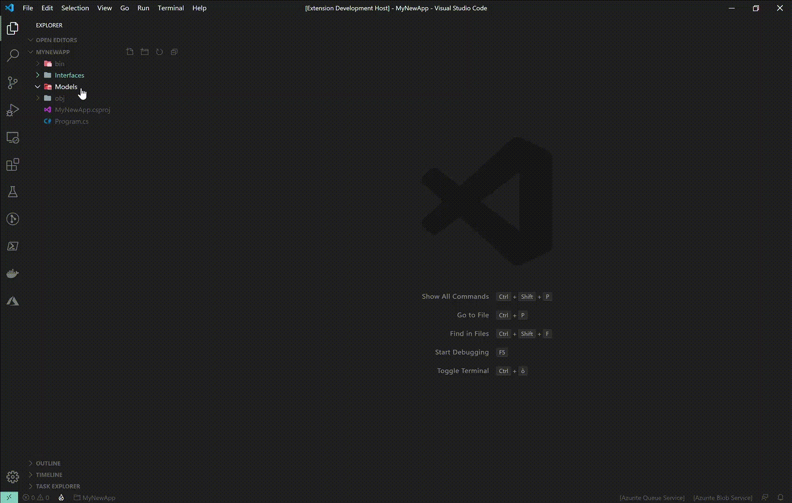

# DotNet Core Add

The extension add the correct namespace, calculating the folder's path up to the `.csproj` file.

## Features

Whit this extension you can

- Add new class on existing file
- Add new interface on existing file
- Add new custom template, selected from a custom folder, on existing file

### Demo



## Instructions

Create new file press F1 and select

- `CS: Add Class` for add new class
  
- `CS: Add Interface` for add new interface

- `CS: Add Custom Template` for add a custom template.

  The engine load the selected file and replace the `$namespace$` with calculated namespace and `$name` with the file name.
  Template content example

  ``` csharp
    namespace $namespace$
    {
        private class $name$
        {
        }
    }
  ```

  You must configure the `dotNetCoreAdd.templateFolderPath` where engine search for the templates

The command grab the file name as the class/interface name

## Extension Settings

This extension contributes the following settings:

- `dotNetCoreAdd.alwaysCapitalizeFirstLetter`: enable/disable the capitalization of first letter
- `dotNetCoreAdd.templateFolderPath`: the templates folder path where `Add Custom Template` command read for template files

## Known Issues

The file MUST be saved before use the extension commands

## Release Notes

See [CHANGELOG](CHANGELOG.md)
