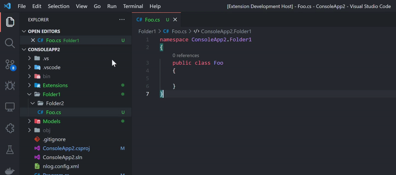

# DotNet Core Add

The extension add the correct namespace, calculating the folder's path up to the `.csproj` file.

## Features

Whit this extension you can

- Add new class on existing file
- Add new interface on existing file

## Instructions

Create new file press F1 and select

- `CS: Add Class` for add new class
- `CS: Add Interface`  for add new interface

The command grab the file name as the class/interface name

## Extension Settings

This extension contributes the following settings:

- `dotnet-core-add.alwaysCapitalizeFirstLetter`: enable/disable the capitalization of first letter

## Known Issues

None

## Release Notes 0.0.3

- Improved the README
- Improved the error message

## Release Notes 0.0.2

This is the initial release and provide support only for

- Class
- Interface
